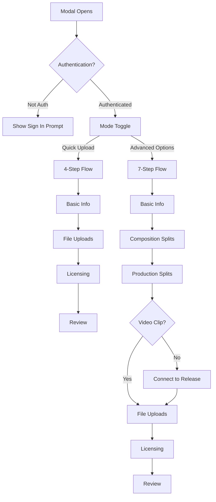
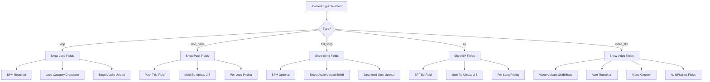
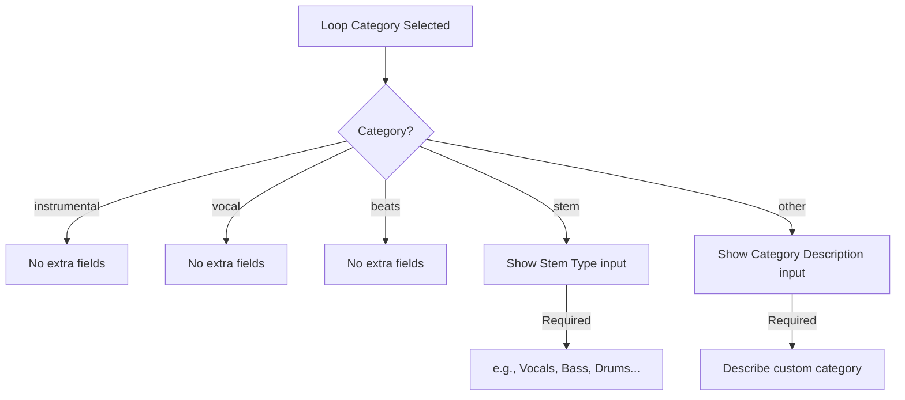
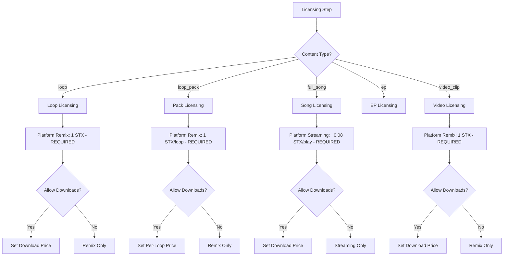
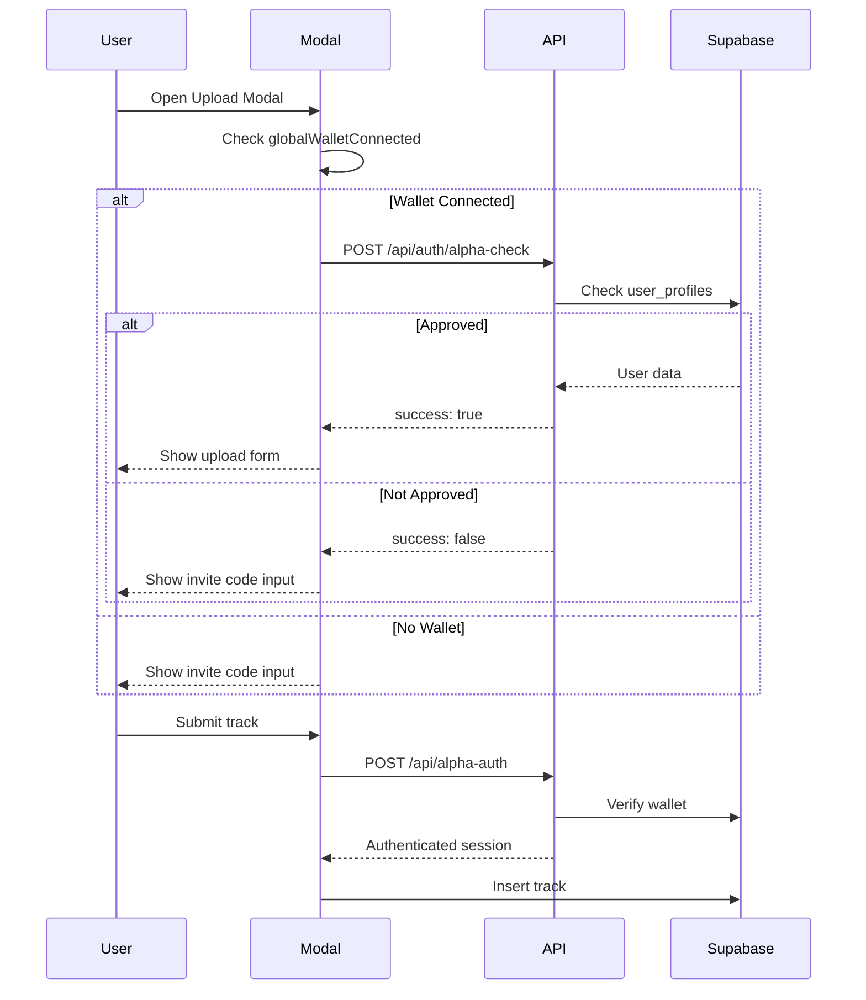

# IPTrackModal Upload Flow Architecture

> **Purpose:** Complete specification for the AI conversational layer that will replace form-based uploads with natural dialogue.
> **Generated:** November 27, 2025

---

## Table of Contents

1. [Content Type Overview](#1-content-type-overview)
2. [Field Inventory](#2-field-inventory)
3. [Conditional Logic & Branching](#3-conditional-logic--branching)
4. [Taxonomies & Controlled Vocabularies](#4-taxonomies--controlled-vocabularies)
5. [Outputs & Integrations](#5-outputs--integrations)
6. [UX Flow Analysis](#6-ux-flow-analysis)
7. [Data Structures](#7-data-structures)

---

## 1. Content Type Overview

### Content Types Handled

IPTrackModal handles **6 primary content types** organized into two categories:

| Category | Content Type | Description | Multi-file? |
|----------|--------------|-------------|-------------|
| **Music** | `loop` | 8-bar loops for remixing | Single |
| **Music** | `loop_pack` | Bundle of 2-5 loops | Multi (2-5 files) |
| **Music** | `full_song` | Complete songs | Single |
| **Music** | `ep` | Bundle of 2-5 songs | Multi (2-5 files) |
| **Visual** | `video_clip` | 5-second video loops | Single |
| **Future** | `still_image` | Static images (planned) | Single |

### Category Filtering

The modal receives a `contentCategory` prop that filters displayed content types:
- `'music'` → Shows: loop, loop_pack, full_song, ep
- `'visual'` → Shows: video_clip (and future: still_image)
- `undefined` (default) → Shows music types only

```typescript
interface IPTrackModalProps {
  contentCategory?: 'music' | 'visual';
}
```

---

## 2. Field Inventory

### 2.1 Universal Fields (All Content Types)

| Field | Data Type | Required | Default | UI Component | Database Column |
|-------|-----------|----------|---------|--------------|-----------------|
| `id` | string (UUID) | Yes | Auto-generated | Hidden | `id` |
| `title` | string | Yes | `''` | Text input | `title` |
| `version` | string | No | `''` | Text input | `version` |
| `artist` | string | Yes | `''` | Autosuggest input | `artist` |
| `description` | string | No | `''` | Textarea | `description` |
| `tags` | string[] | No | `[]` | Comma-separated input | `tags` (JSON) |
| `wallet_address` | string | Yes | Auth wallet | Text input (locked) | `uploader_address` |
| `cover_image_url` | string | No | `''` | Image uploader | `cover_image_url` |
| `notes` | string | No | `''` | Textarea | `notes` |
| `primary_location` | string | No | `''` | Autocomplete | `primary_location` |
| `location_lat` | number | No | `null` | Auto from autocomplete | `location_lat` |
| `location_lng` | number | No | `null` | Auto from autocomplete | `location_lng` |

### 2.2 AI Assistance Tracking (All Types)

| Field | Data Type | Required | Default | Options |
|-------|-----------|----------|---------|---------|
| `ai_assisted_idea` | boolean | No | `false` | 🙌 100% Human / 🙌🤖 AI-Assisted / 🤖 AI-Generated |
| `ai_assisted_implementation` | boolean | No | `false` | Combined with above |

**Logic:**
- `ai_assisted_idea=false, ai_assisted_implementation=false` → 100% Human
- `ai_assisted_idea=true, ai_assisted_implementation=false` → AI-Assisted
- `ai_assisted_idea=true, ai_assisted_implementation=true` → AI-Generated

### 2.3 Composition Splits (All Types)

Up to 3 collaborators for "Who wrote it" (ideas, melodies, lyrics, direction):

| Field | Data Type | Required | Default | Validation |
|-------|-----------|----------|---------|------------|
| `composition_split_1_wallet` | string | Yes | Auth wallet | Must be Stacks address (SP.../SM...) |
| `composition_split_1_percentage` | number | Yes | `100` | 0-100, total must = 100 |
| `composition_split_2_wallet` | string | No | `''` | Must be Stacks address if % > 0 |
| `composition_split_2_percentage` | number | No | `0` | 0-100 |
| `composition_split_3_wallet` | string | No | `''` | Must be Stacks address if % > 0 |
| `composition_split_3_percentage` | number | No | `0` | 0-100 |

### 2.4 Production Splits (All Types)

Up to 3 collaborators for "Who made it" (production, recording, engineering):

| Field | Data Type | Required | Default | Validation |
|-------|-----------|----------|---------|------------|
| `production_split_1_wallet` | string | Yes | Auth wallet | Must be Stacks address |
| `production_split_1_percentage` | number | Yes | `100` | 0-100, total must = 100 |
| `production_split_2_wallet` | string | No | `''` | |
| `production_split_2_percentage` | number | No | `0` | |
| `production_split_3_wallet` | string | No | `''` | |
| `production_split_3_percentage` | number | No | `0` | |

### 2.5 Loop-Specific Fields

| Field | Data Type | Required | Default | Options |
|-------|-----------|----------|---------|---------|
| `loop_category` | string | No | `'instrumental'` | See [Loop Categories](#loop-categories) |
| `tell_us_more` | string | Conditional | `''` | Required if `loop_category` is `'stem'` or `'other'` |
| `bpm` | integer | Yes (loops) | `0` | 60-200, auto-detected from audio |
| `key` | string | No | `''` | Musical key signature |
| `audio_url` | string | Yes | `''` | Uploaded file URL |
| `duration` | number | No | Auto | Seconds, auto-detected |

### 2.6 Loop Pack-Specific Fields

| Field | Data Type | Required | Default | Validation |
|-------|-----------|----------|---------|------------|
| `pack_title` | string | Yes | `''` | Replaces `title` for packs |
| `pack_description` | string | No | `''` | Pack-level description |
| `loop_files` | File[] | Yes | `[]` | 2-5 audio files, max 10MB each |
| `bpm` | integer | No | `0` | Same BPM applied to all loops |
| `price_per_loop` | number | Conditional | `0.5` | If downloads enabled |

### 2.7 Song-Specific Fields

| Field | Data Type | Required | Default | Notes |
|-------|-----------|----------|---------|-------|
| `audio_url` | string | Yes | `''` | Up to 50MB |
| `bpm` | number | No | `null` | Optional for songs (set to null) |
| `download_price_stx` | number | Conditional | `2` | If downloads enabled |

### 2.8 EP-Specific Fields

| Field | Data Type | Required | Default | Validation |
|-------|-----------|----------|---------|------------|
| `ep_title` | string | Yes | `''` | Replaces `title` for EPs |
| `ep_files` | File[] | Yes | `[]` | 2-5 audio files, max 50MB each |
| `price_per_song` | number | Conditional | `2.5` | If downloads enabled |

### 2.9 Video Clip-Specific Fields

| Field | Data Type | Required | Default | Validation |
|-------|-----------|----------|---------|------------|
| `video_url` | string | Yes | `''` | Max 10MB, 5 seconds max |
| `video_crop_x` | number | No | `null` | Crop position X |
| `video_crop_y` | number | No | `null` | Crop position Y |
| `video_crop_width` | number | No | `null` | Crop area width |
| `video_crop_height` | number | No | `null` | Crop area height |
| `video_crop_zoom` | number | No | `1` | 1.0-3.0 zoom level |
| `video_natural_width` | number | No | `null` | Original video width |
| `video_natural_height` | number | No | `null` | Original video height |
| `audio_source` | string | No | `'included'` | `'included'` / `'silent'` / `'separate'` |

**Video Audio Policy Note:**
> Audio in video clips inherits the video's IP attribution. Audio must be 100% human-created. No AI-generated music allowed.

### 2.10 Licensing Fields

| Field | Data Type | Required | Default | Notes |
|-------|-----------|----------|---------|-------|
| `license_type` | string | No | `'remix_only'` | `'remix_only'` / `'remix_external'` / `'custom'` |
| `license_selection` | string | No | `'platform_remix'` | `'platform_remix'` / `'platform_download'` |
| `allow_remixing` | boolean | No | `true` | Always true for loops, false for songs |
| `allow_downloads` | boolean | No | `false` | Optional for all types |
| `remix_price_stx` | number | No | `1.0` | Fixed at 1 STX for loops/videos |
| `download_price_stx` | number | No | `null` | Custom price when downloads enabled |
| `price_stx` | number | No | `2.5` | Legacy combined price field |

### 2.11 Contact/Collaboration Fields

| Field | Data Type | Required | Default | Notes |
|-------|-----------|----------|---------|-------|
| `open_to_commercial` | boolean | No | `false` | Accept sync/licensing inquiries |
| `commercial_contact` | string | Conditional | `''` | Required if `open_to_commercial` |
| `commercial_contact_fee` | number | No | `10` | STX fee to unlock contact |
| `open_to_collaboration` | boolean | No | `false` | Accept collab proposals |
| `collab_contact` | string | Conditional | `''` | Required if `open_to_collaboration` |
| `collab_contact_fee` | number | No | `1` | STX fee to unlock contact |

### 2.12 Metadata Fields (Auto-populated)

| Field | Data Type | Notes |
|-------|-----------|-------|
| `created_at` | timestamp | Auto on insert |
| `updated_at` | timestamp | Auto on update |
| `primary_uploader_wallet` | string | From auth |
| `uploader_address` | string | From auth |
| `remix_depth` | number | 0 for originals, null for songs |
| `source_track_ids` | string[] | Empty for originals |
| `is_live` | boolean | Always `true` |

---

## 3. Conditional Logic & Branching

### 3.1 Mode Toggle: Quick Upload vs Advanced



**Quick Upload Auto-Defaults:**
- Sets authenticated wallet for 100% composition AND production splits
- Skips split configuration steps
- 4 steps total

**Advanced Options:**
- Manual split configuration for collaborations
- 7 steps (6 for video clips - skips Connect to Release)

### 3.2 Content Type Branching



### 3.3 Loop Category Conditional Fields



### 3.4 Licensing Flow by Content Type



### 3.5 File Validation Rules

| Content Type | File Types | Min Files | Max Files | Max Size Per File | Duration Limit |
|--------------|-----------|-----------|-----------|-------------------|----------------|
| `loop` | MP3, WAV, FLAC, M4A, OGG | 1 | 1 | 50MB | None |
| `loop_pack` | MP3, WAV, FLAC, M4A, OGG | 2 | 5 | 10MB | None |
| `full_song` | MP3, WAV, FLAC, M4A, OGG | 1 | 1 | 50MB | None |
| `ep` | MP3, WAV, FLAC, M4A, OGG | 2 | 5 | 50MB | None |
| `video_clip` | MP4, MOV, AVI, WebM | 1 | 1 | 10MB | 5 seconds |

---

## 4. Taxonomies & Controlled Vocabularies

### 4.1 Loop Categories

```typescript
export const LOOP_CATEGORIES = [
  { value: 'instrumental', label: 'Instrumental' },
  { value: 'vocal', label: 'Vocal' },
  { value: 'beats', label: 'Beats' },
  { value: 'stem', label: 'Stem' },
  { value: 'other', label: 'Other' }
] as const;
```

**Storage:** Direct value in `loop_category` column.

### 4.2 Content Types

```typescript
export const CONTENT_TYPES = [
  'full_song',
  'loop',
  'loop_pack',
  'ep',
  'mix',
  'video_clip',
  'radio_station',  // Special - not uploadable via modal
  'station_pack'    // Special - not uploadable via modal
] as const;
```

**Storage:** Direct value in `content_type` column.

### 4.3 License Types

```typescript
const LICENSE_TYPES = [
  'remix_only',      // Platform remix only
  'remix_external',  // Remix + download
  'custom'           // Future custom licensing
];

const LICENSE_SELECTIONS = [
  'platform_remix',    // Default for loops
  'platform_download', // Default for songs
  'streaming_only',    // Songs without downloads
  'streaming_download' // Songs with downloads
];
```

### 4.4 AI Assistance Options

| Selection | ai_assisted_idea | ai_assisted_implementation | Badge |
|-----------|------------------|---------------------------|-------|
| 100% Human | `false` | `false` | 🙌 |
| AI-Assisted | `true` | `false` | 🙌🤖 |
| AI-Generated | `true` | `true` | 🤖 |

### 4.5 Tags (Free-form)

- **Input:** Comma-separated text
- **Processing:** Split by comma, trim whitespace, filter empty
- **Location Tags:** Auto-added with 🌍 prefix (e.g., "🌍 London, UK")
- **Storage:** JSON array in `tags` column

---

## 5. Outputs & Integrations

### 5.1 Database Record Creation

**Primary Table:** `ip_tracks`

On successful submission:

```typescript
// Single track (loop, song, video)
const trackRecord = await supabase
  .from('ip_tracks')
  .insert([mappedTrackData])
  .select('id, title, artist, content_type, created_at');

// Loop pack creates:
// 1. Individual loop records (content_type: 'loop', pack_id: packId)
// 2. Master pack record (content_type: 'loop_pack', id: packId)

// EP creates:
// 1. Individual song records (content_type: 'full_song', pack_id: epId)
// 2. Master EP record (content_type: 'ep', id: epId)
```

### 5.2 Certificate Generation

After successful insert, `CertificateService.generateAndStoreCertificate()` is called asynchronously:

```typescript
const certificateData = {
  id: track.id,
  title: track.title,
  version: track.version,
  artist: track.artist,
  duration: track.duration,
  bpm: track.bpm,
  key: track.key,
  tags: track.tags,
  description: track.description,
  coverImageUrl: track.cover_image_url,
  content_type: track.content_type,
  remix_depth: track.remix_depth,
  open_to_commercial: track.open_to_commercial,
  commercial_contact: track.commercial_contact,
  commercial_contact_fee: track.commercial_contact_fee,
  open_to_collaboration: track.open_to_collaboration,
  collab_contact: track.collab_contact,
  collab_contact_fee: track.collab_contact_fee,
  composition_splits: [...],  // Array of { wallet, percentage }
  production_splits: [...],   // Array of { wallet, percentage }
  license_type: track.license_type,
  price_stx: track.price_stx,
  walletAddress: effectiveWalletAddress,
  timestamp: new Date()
};
```

**Certificate Storage:** Generated PDF stored in Supabase storage.

### 5.3 File Storage Buckets

| Bucket | Content | Path Pattern |
|--------|---------|--------------|
| `user-content` | Audio files | `audio/{walletAddress}-{timestamp}-{index}.{ext}` |
| `cover-images` | Cover artwork | `{uuid}.{ext}` |
| `video-clips` | Video files | `{uuid}.mp4` |
| `certificates` | PDF certificates | See CertificateService |

### 5.4 Authentication Flow



### 5.5 Smart Contract Integration (Future)

**Fields prepared for on-chain:**
- `composition_split_*_wallet` - For royalty distribution
- `production_split_*_wallet` - For royalty distribution
- `remix_depth` - Generation tracking
- `source_track_ids` - Attribution chain

**Not yet implemented:** Stacks transaction creation for on-chain registration.

---

## 6. UX Flow Analysis

### 6.1 Step-by-Step Journey

#### Quick Upload Mode (4 Steps)

| Step | Name | Fields Collected |
|------|------|-----------------|
| 1 | Basic Information | Content type, title, artist, description, tags, location, AI assistance, BPM/key (if applicable) |
| 2 | File Uploads | Cover image (optional), Audio/Video file |
| 3 | Licensing & Pricing | License selection, download toggle, pricing |
| 4 | Review & Submit | Summary, Terms acceptance, Submit |

#### Advanced Mode (7 Steps)

| Step | Name | Fields Collected |
|------|------|-----------------|
| 1 | Basic Information | Same as Quick Upload |
| 2 | Who Wrote It? | Composition splits (3 wallets + percentages) |
| 3 | Who Made It? | Production splits (3 wallets + percentages) |
| 4 | Connect to Release | ISRC code (optional) - **Skipped for video_clip** |
| 5 | File Uploads | Same as Quick Upload |
| 6 | Licensing & Pricing | Same as Quick Upload + commercial/collab options |
| 7 | Review & Submit | Same as Quick Upload |

### 6.2 Timing Estimates

Based on complexity and file sizes:

| Content Type | Quick Upload | Advanced Mode |
|--------------|-------------|---------------|
| Loop (single) | 2-3 minutes | 4-5 minutes |
| Loop Pack (5 files) | 5-7 minutes | 7-10 minutes |
| Song | 2-3 minutes | 4-5 minutes |
| EP (5 songs) | 7-10 minutes | 10-15 minutes |
| Video Clip | 3-4 minutes | 5-7 minutes |

*Estimates include file upload time over average connection.*

### 6.3 Validation Checkpoints

| Stage | Validations |
|-------|------------|
| File Selection | File type, file size, file count |
| BPM Entry | Required for loops, integer only, 60-200 range |
| Splits Entry | Total = 100%, wallets valid if % > 0 |
| Location | Coordinates within valid ranges |
| Final Submit | All required fields, audio/video uploaded, terms accepted |

### 6.4 Error States

```typescript
// Validation error display
{validationErrors.length > 0 && (
  <div className="bg-red-900/20 border border-red-500/50 rounded-lg p-4">
    <h4>Please fix these issues:</h4>
    <ul>
      {validationErrors.map((error) => (
        <li>{error}</li>
      ))}
    </ul>
  </div>
)}
```

**Common Error Messages:**
- "Track title is required"
- "Artist name is required"
- "BPM is required for loops and must be a valid number greater than 0"
- "Audio file is required"
- "Video must be 5 seconds or less"
- "Please select at least 2 audio files for a loop pack"
- "Composition split percentages must total 100%"

---

## 7. Data Structures

### 7.1 Form Data Interface

```typescript
interface IPTrackFormData {
  // Identity
  id: string;
  title: string;
  version: string;
  artist: string;
  description: string;
  tell_us_more: string;
  tags: string[];
  notes: string;

  // Classification
  content_type: ContentType;
  loop_category: string;
  sample_type: string;  // Legacy

  // Audio Characteristics
  bpm: number;
  key: string;
  duration?: number;

  // Attribution
  wallet_address: string;

  // Location
  location_lat?: number;
  location_lng?: number;
  primary_location?: string;

  // Composition Splits (x3)
  composition_split_1_wallet: string;
  composition_split_1_percentage: number;
  composition_split_2_wallet: string;
  composition_split_2_percentage: number;
  composition_split_3_wallet: string;
  composition_split_3_percentage: number;

  // Production Splits (x3)
  production_split_1_wallet: string;
  production_split_1_percentage: number;
  production_split_2_wallet: string;
  production_split_2_percentage: number;
  production_split_3_wallet: string;
  production_split_3_percentage: number;

  // Media
  cover_image_url: string;
  audio_url: string;

  // Licensing
  license_type: 'remix_only' | 'remix_external' | 'custom';
  license_selection: 'platform_remix' | 'platform_download';
  allow_remixing: boolean;
  allow_downloads: boolean;
  open_to_commercial: boolean;
  open_to_collaboration: boolean;

  // AI Tracking
  ai_assisted_idea: boolean;
  ai_assisted_implementation: boolean;

  // Audio Source (video)
  audio_source: 'included' | 'silent' | 'separate';

  // Pricing
  price_stx: number;
  remix_price: number;
  combined_price: number;
  download_price: number;

  // Contact
  commercial_contact: string;
  commercial_contact_fee: number;
  collab_contact: string;
  collab_contact_fee: number;
}
```

### 7.2 Database Schema (ip_tracks table)

```sql
CREATE TABLE ip_tracks (
  -- Identity
  id UUID PRIMARY KEY DEFAULT uuid_generate_v4(),
  title TEXT NOT NULL,
  version TEXT,
  artist TEXT NOT NULL,
  description TEXT,
  tell_us_more TEXT,
  notes TEXT,
  tags JSONB DEFAULT '[]'::jsonb,

  -- Classification
  content_type TEXT NOT NULL,
  loop_category TEXT,
  sample_type TEXT,

  -- Audio Characteristics
  bpm INTEGER,
  key TEXT,
  duration INTEGER,
  isrc_number TEXT,

  -- Media URLs
  cover_image_url TEXT,
  audio_url TEXT,
  video_url TEXT,
  stream_url TEXT,  -- For radio stations

  -- Video Crop Data
  video_crop_x INTEGER,
  video_crop_y INTEGER,
  video_crop_width INTEGER,
  video_crop_height INTEGER,
  video_crop_zoom DECIMAL,
  video_natural_width INTEGER,
  video_natural_height INTEGER,

  -- Location
  location_lat DECIMAL(10,8),
  location_lng DECIMAL(11,8),
  primary_location TEXT,
  locations JSONB,

  -- Composition Splits
  composition_split_1_wallet TEXT,
  composition_split_1_percentage DECIMAL(5,2),
  composition_split_2_wallet TEXT,
  composition_split_2_percentage DECIMAL(5,2),
  composition_split_3_wallet TEXT,
  composition_split_3_percentage DECIMAL(5,2),

  -- Production Splits
  production_split_1_wallet TEXT,
  production_split_1_percentage DECIMAL(5,2),
  production_split_2_wallet TEXT,
  production_split_2_percentage DECIMAL(5,2),
  production_split_3_wallet TEXT,
  production_split_3_percentage DECIMAL(5,2),

  -- Licensing
  license_type TEXT,
  license_selection TEXT,
  allow_remixing BOOLEAN DEFAULT true,
  allow_downloads BOOLEAN DEFAULT false,
  open_to_commercial BOOLEAN DEFAULT false,
  open_to_collaboration BOOLEAN DEFAULT false,

  -- AI Tracking
  ai_assisted_idea BOOLEAN DEFAULT false,
  ai_assisted_implementation BOOLEAN DEFAULT false,
  audio_source TEXT DEFAULT 'included',

  -- Pricing
  price_stx DECIMAL(10,2),
  remix_price_stx DECIMAL(10,2),
  download_price_stx DECIMAL(10,2),

  -- Contact
  commercial_contact TEXT,
  commercial_contact_fee DECIMAL(10,2),
  collab_contact TEXT,
  collab_contact_fee DECIMAL(10,2),

  -- Pack/EP System
  pack_id UUID,
  pack_position INTEGER,
  total_loops INTEGER,

  -- Remix Tracking
  remix_depth INTEGER,
  source_track_ids JSONB DEFAULT '[]'::jsonb,

  -- Metadata
  created_at TIMESTAMP WITH TIME ZONE DEFAULT NOW(),
  updated_at TIMESTAMP WITH TIME ZONE DEFAULT NOW(),
  deleted_at TIMESTAMP WITH TIME ZONE,

  -- Ownership
  uploader_address TEXT NOT NULL,
  primary_uploader_wallet TEXT,
  account_name TEXT,
  main_wallet_name TEXT,
  is_live BOOLEAN DEFAULT true,

  -- Collaboration
  collaboration_preferences JSONB DEFAULT '{}'::jsonb,
  store_display_policy TEXT DEFAULT 'primary_only',
  collaboration_type TEXT DEFAULT 'primary_artist'
);
```

### 7.3 Key File References

| File | Purpose |
|------|---------|
| `components/modals/IPTrackModal.tsx` | Main upload modal (~3000 lines) |
| `hooks/useIPTrackForm.ts` | Form state management |
| `hooks/useIPTrackSubmit.ts` | Submission logic, pack/EP processing |
| `hooks/useAudioUpload.ts` | Audio file upload + BPM detection |
| `components/modals/steps/SimplifiedLicensingStep.tsx` | Licensing UI per content type |
| `types/index.ts` | TypeScript interfaces |
| `lib/certificate-service.ts` | Certificate generation |
| `lib/auth/supabase-auth-bridge.ts` | Auth session management |

---

## Appendix: AI Conversation Design Notes

### Key Conversational Branching Points

1. **Content Type Selection** - First major branch
   - "What are you uploading today?" → Routes to type-specific questions

2. **Solo vs Collaboration** - Second major branch
   - "Did you create this yourself, or with collaborators?"
   - Solo → Skip split questions, auto-assign 100%
   - Collab → "Who else worked on the ideas?" + "Who else worked on the production?"

3. **Licensing Choices** - Third major branch
   - Loops/Videos: "Would you like people to be able to download this for external use?"
   - Songs: "Would you like to offer downloads?"

4. **Optional Additions**
   - Location: "Where are you based creatively?"
   - Commercial: "Open to sync/licensing opportunities?"
   - Collaboration: "Open to collaboration proposals?"

### Minimum Required Information by Type

| Type | Absolute Minimum |
|------|-----------------|
| Loop | Title, Artist, BPM, Audio file, Terms |
| Loop Pack | Pack title, Artist, BPM, 2+ audio files, Terms |
| Song | Title, Artist, Audio file, Terms |
| EP | EP title, Artist, 2+ audio files, Terms |
| Video | Title, Artist, Video file, Terms |

### Smart Defaults to Apply

- `wallet_address` → Auth wallet
- `composition_split_1_*` → 100% to auth wallet
- `production_split_1_*` → 100% to auth wallet
- `remix_price_stx` → 1.0 STX
- `download_price_stx` → 2.0 STX (songs), 1.0 STX (loops)
- `ai_assisted_*` → false (100% Human)
- `allow_downloads` → false
- `open_to_commercial` → false
- `open_to_collaboration` → false

---

*Document generated by Claude Code analysis of IPTrackModal upload system.*
